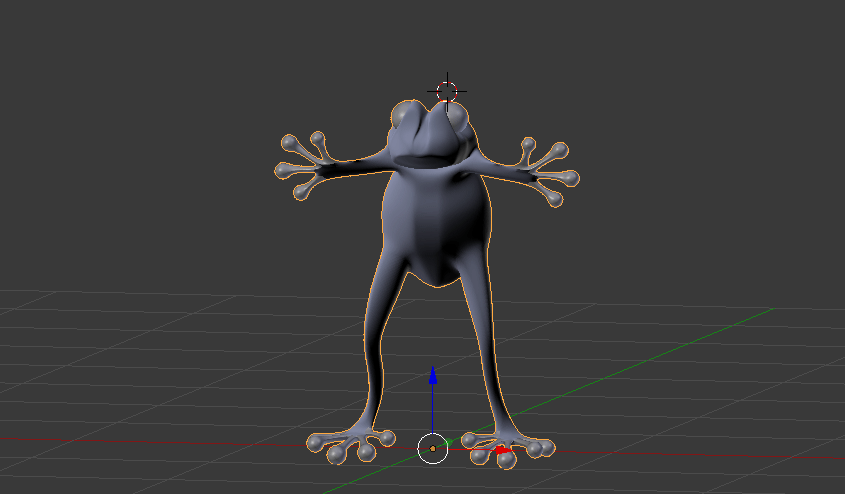

# Magnetic Frog

## Graphics
### Draw icon
1. Draw the outline (Free Select Tool with antialisaing and Feather edges radius to 20) and save it as path
2. Select > Border > 4px (Border style **Hard**)
3. Select > Feather > 5px
4. Fill with outline color
5. Select from previous path
6. Select > Shrink > 2px
7. Fill with background color

### Blured UI background
Filters > Blur > Median Blur > Radius: 6

## Credits
* "Water Swirl" by InspectorJ of Freesound.org
* "Underwater ambience" by akemov of Freesound.org
* "Perspectives" by Kevin MacLeod of incompetech.com
* Main theme and all sounds FX were kindly made by [Nullrate](http://nullrate.com/)